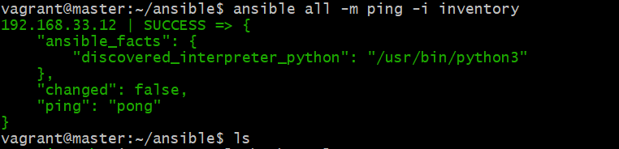
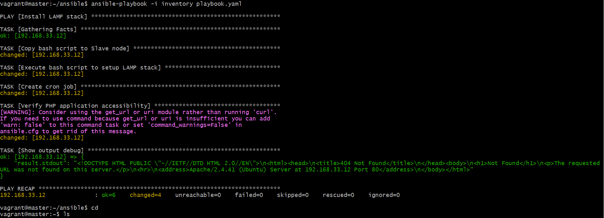

### AltSchool 2nd Semester Exam

# Setting up the Ubuntu (MAster and Slave)
I set up Master and Slave inside one vagrant file

# Both MAster and Slave was set up successfully

The Bashscript for the LAMP  was successful after running it, it is readale and reusable 

The Master is connect to the Slave 

My Laravel was successfully after running it

